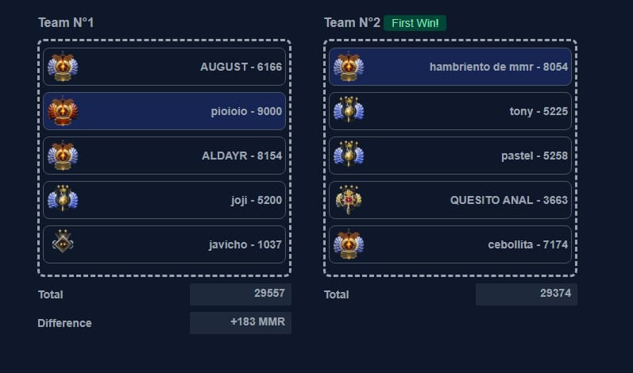
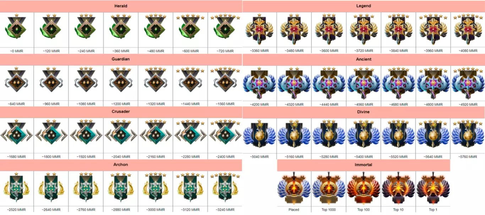

# Match making dota 2

Tool usefulll for create 2 groups `Radiance`, `Dire` from
10 gamers and, below is the final result of the system:

Reference of the MMR Level

## start project

    cd app-frontend
    docker-compose up --build

## Technical Docs

### techs

- NuxtJS
- Dockeritation (docker, docker-compose)
- Git
- Node 18.x

### Make project nuxt v3

    npx nuxi@latest init match-making-dota-2

